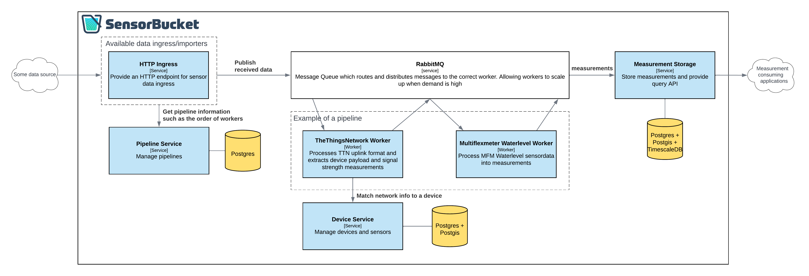

# Architecture

Below is an overview of the SensorBucket architecture. Data generally flows from left to right (ingress / egress). Several sections are explained below the image. 

!!! tip
    Click the image to get a better view

<figure markdown>

</figure>

## Data ingress

There are multiple ways that sensor devices or vendors can provide sensor data to you. SensorBucket provides a set of services which act as data importers. These importers provide a way for sensor data to enter the system. Examples would be: HTTP ingress, MQTT and FTP.

!!! note
    Currently sensorbucket supports only the HTTP Ingress service, which provides an endpoint to which sensor devices and vendors can post data.

## Pipelines

While data ingress receives device sensor data, it does not know which workers should process the received data. 

The data ingress service must be able to associate a pipeline ID to the received message, either provided by the external source or configured by an administrator. 

Using the pipeline ID the data ingress service fetches the order of workers that should process the received data and publishes this along with the data to the message queue. The message queue will route it to the according workers.

## Workers 

Workers are services specific to processing incoming data. The workers receive data from the message queue, process it, and pushes it back to the message queue; very similar to ETL scripts that is.

Somewhere in the pipeline of workers, there is a worker that must be able to associate the incoming data to a device in SensorBucket. In the case of LoRaWAN a worker could query the devices endpoint and filter on the arbitrary `properties.dev_eui` property to find the matching device.

Along the pipeline of workers, each worker can append measurements and data to the message that is routed to the next worker. 

Workers are not deployed as regular services, instead they use the [Fission](https://fission.io/) framework to automatically be built and deployed. For more information see [Workers](/workers).

## Device service

The device service is an administrative service containing information about devices and their sensors. It is used to configure new devices, making their data available for processing.

See the [SensorBucket Data Model](/development/data-model) for more information.

## Measurement storage

After the final worker has processed the data, the result should be a message with a SensorBucket device, general information like the timestamp and a list of measurements. The measurement storage will store these measurements in a timeseries database (provide by the TimescaleDB plugin for PostgreSQL).

The measurement storage also provides a simple endpoint for querying measurements at `/api/v1/measurements` using the following query parameters:

!!! tip
    The parameters for which _Allow multiple_ is true, can be specified multiple times and act as an _OR_ clause.

|Parameter|Required|Allow multiple|Description|
|-|-|-|-|
|`start`|Yes|No|The start datetime in ISO8601
|`end`|Yes|No|The end datetime in ISO8601
|`device_id`|No|Yes|Filter on specific device_ids
|`measurement_type`|No|Yes|Filter on specific measurement types
|`sensor_code`|No|Yes|Filter on specific sensor codes
