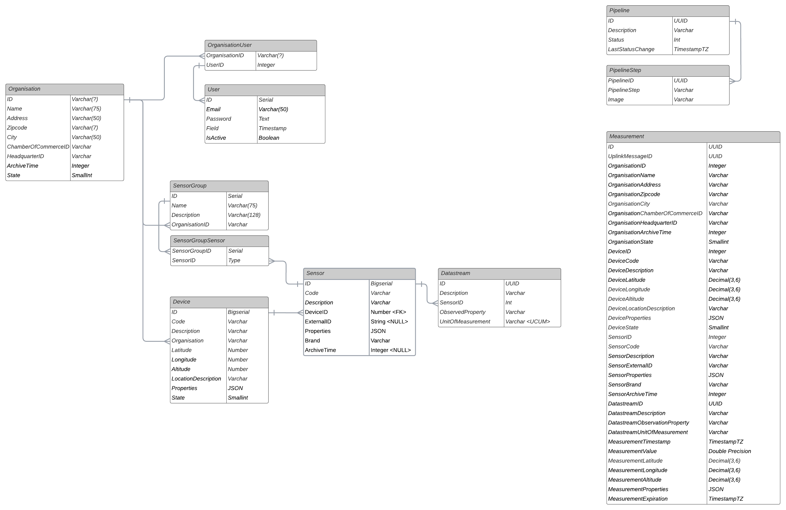

# Data model

Below is an export of the SensorBucket ERD. Click the image to enlarge it.

<figure markdown>

</figure>

## Entities

### Organisation

An organisation is the owner of most entities in SensorBucket, such as but not limited to: Devices, Sensors, Groups, Datastreams and more.
Users belong to organisations and can perform actions on its behalf.

|Column|Description|
|-|-|
|ID|-|
|Name|-|
|Address|-|
|Zipcode|-|
|City|-|
|ChamberOfCommerceID|The Chamber of Commerce registration ID|
|HeadquarterID|The main establishment registration ID|
|ArchiveTime|A duration in days after which a new measurements will be archived and removed|
|State|Organisation state, either: active or inactive|

### User

A user account with access to SensorBucket. Not yet implemented, might be substituted with an Identity Management service.

|Column|Description|
|-|-|
|ID|-|
|Email|-|
|Password|-|
|IsActive|-|

### OrganisationUser

The join table between users and organisations. A record in this table indicates that a user is part of that organisation.

|Column|Description|
|-|-|
|OrganisationID|The ID of the organisation|
|OrganisationUserID|The ID of the user that is a member of this organisation|

### Device

A device represents a some object that uses sensors to collect data and transmit this bundle of data to the SensorBucket system. The device determines in what format the data is sent.

|Column|Description|
|-|-|
|ID|-|
|Code|A user supplied arbitrary code for the device, for organisation internal tracking|
|Description|A user supplied description for this device|
|OrganisationID|-|
|Latitude|Optional latitude coordinate in EPSG4326|
|Longitude|Optional longitude coordinate in EPSG4326|
|Altitude|Optional altitude coordinate in arbitrary value of altitude|
|LocationDescription|Arbitrary description of the location, could be a address|
|Properties|A key-value object containing device specific properties|
|State|Device state set by user, either: active or inactive.|

### Sensor
An entity that observes one or more properties and returns measurements to the device for transmission. The combination of a Sensor and an observed property is a Datastream.

|Column|Description|
|-|-|
|ID|-|
|Code|A user supplied arbitrary code for the sensor, for organisation internal tracking|
|Description|A user supplied description for this sensor|
|DeviceID|The ID of the device this sensor belongs to|
|ExternalID|This field is used to match a sensor reading from external data to the internal data. If the device sends measurements sequentially concatenated, then this might be an index number (depends on the worker implementation). If the external source sends a key-value pair, this might be the key.|
|Properties|A key-value object containing device specific properties|
|Brand|A user supplied arbitrary sensor brand, for organisation internal tracking|
|ArchiveTime|Optionally override archive time per sensor. Archive time is in days|

### Datastream
A sensor observes one or more properties. A unique combination of sensor and observed property is a datastream. In other words, a datastream is always one unique timeseries of an observed property.

|Column|Description|
|-|-|
|ID|-|
|Description|A default or user modified description for this datastream|
|SensorID|The ID of the sensor which produces data to this datastream|
|ObservedProperty|The "what" that is being observed. This must be unique per sensor, i.e. one sensor cannot have duplicate observed properties. The value is determined by the worker. For a particulate matter sensor this can be: pm2_5_mass, pm10_mass, pm20_mass|
|UnitOfMeasurement|The unit in which measurements in this datastream are stored. This must comply with the UCUM specification|

### SensorGroup

A sensor group can hold one or more sensors and allows users to logically group sensors.

|Column|Description|
|-|-|
|ID|-|
|Name|A user supplied name for the group|
|Description|A user supplied description|
|OrganisationID|The ID of the organisation this group belongs to|

### SensorGroupSensor

As sensor groups are a many-to-many relation, this table manages which sensors belong to what groups.

|Column|Description|
|-|-|
|SensorGroupID|The ID of the sensor group|
|SensorID|The ID of the sensor belonging to that group|

### Pipeline
A pipeline is a sequence of workers that some uplink data will be processed by. For example, device Multiflexmeter works on TheThingsNetwork and Chirpstack. However, both networks wrap the duplinks different formats. With three workers, two pipelines can be created:

 - Pipeline A: TheThingsNetwork -> Multiflexmeter -> Measurement storage  
 - Pipeline B: ChirpStack -> Multiflexmeter -> Measurement storage

|Column|Description|
|-|-|
|ID|A UUID formatted identifier|
|Description|A user supplied description|
|Status|Pipeline status, either: active or inactive|
|LastStatusChange|The last date and time that the status was changed|

### PipelineStep
A single step in the sequence of a pipeline. 

|Column|Description|
|-|-|
|PipelineID|The UUID of the pipeline this step belongs in|
|PipelineStep|The index of this step (e.g. 0,1,2,3,4...)|
|Image|Eventually the cointainer image of the worker, for now this is the topic for the Message Queue on which the uplink will be published|

### Measurements
A measurement by a sensor. This measurement model contains all related data for historical purposes. This includes: Organisation, Device, Sensor, Datastream. Below are only the additions to these specifically for this model.

|Column|Description|
|-|-|
|ID|-|
|UplinkMessageID|The UUID unique ID of the uplink message this measurement originates from|
|MeasurementTimestamp|The timestamp this measurement was taken|
|MeasurementValue|The value of the measurement|
|MeasurementLatitude|The latitude coordinate where this measurement was taken, if device does not provide location, then falls back to device latitude|
|MeasurementLongitude|The longitude coordinate where this measurement was taken, if device does not provide location, then falls back to device longitude|
|MeasurementAltitude|The altitude coordinate where this measurement was taken, if device does not provide location, then falls back to device altitude|
|MeasurementProperties|A key-value object containing measurement specific properties|
|MeasurementExpiration|The date time on which this measurement will expire and be archived or removed|

