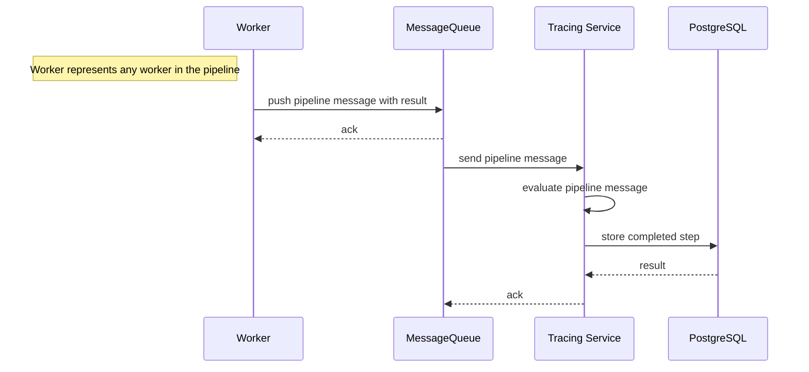

# Tracing

SensorBucket processes large amounts of valuable data. To ensure no data is lost all data points are traced within the system. The tracing service achieves goal by performing two main functions:

- Store all incoming datapoints raw in the database
- Track each step the datapoint takes within the sysem

## Configuration

The tracing service requires the following environment variables to be set in order to run:

| Variable                    | Description                                                                                                               | Required | Default         |
| --------------------------- | ------------------------------------------------------------------------------------------------------------------------- | -------- | --------------- |
| DB_DSN                      | The connection string for the PostgreSQL database                                                                         | Yes      |                 |
| AMQP_HOST                   | The RabbitMQ host                                                                                                         | Yes      |                 |
| AMQP_QUEUE_PIPELINEMESSAGES | The queue on which pipeline messages appear                                                                               | Yes      |                 |
| AMQP_QUEUE_ERRORS           | The queue on which any errors produced by workers appear                                                                  | Yes      |                 |
| AMQP_QUEUE_INGRESS          | The topic on which new datapoints will appear                                                                             | No       | archive-ingress |
| AMQP_XCHG_INGRESS           | The exchange on which ingress messages will appear. The tracing service will declare the exchange if it doesn't exist yet | No       | ingress         |
| AMQP_XCHG_INGRESS_TOPIC     | The topic on the exhange where ingress messages will be read from                                                         | No       | ingress.*       |

## Domain

### Step

Every pipeline message that appears on the message queue is evaluated by the Tracing Service and stored as a 'step' in the database. A step has the following format:

| Column         | Description                                                                                    |
| -------------- | ---------------------------------------------------------------------------------------------- |
| TracingID      | ID used to match a data point to the step                                                      |
| StepIndex      | Index of the current step to be executed from the pipeline steps array in the pipeline message |
| StepsRemaining | Counts the remaining steps left for the data point                                             |
| StartTime      | Time at which the pipeline message appeared on the Message Queue                               |
| Error          | If an error has occurred in the step it is stored here                                         |

#### Tracing flow

Whenever a worker receives a pipeline message to process and the result is posted to the Message Queue the Tracing Service will evaluate the result and store a completed step in the database.

