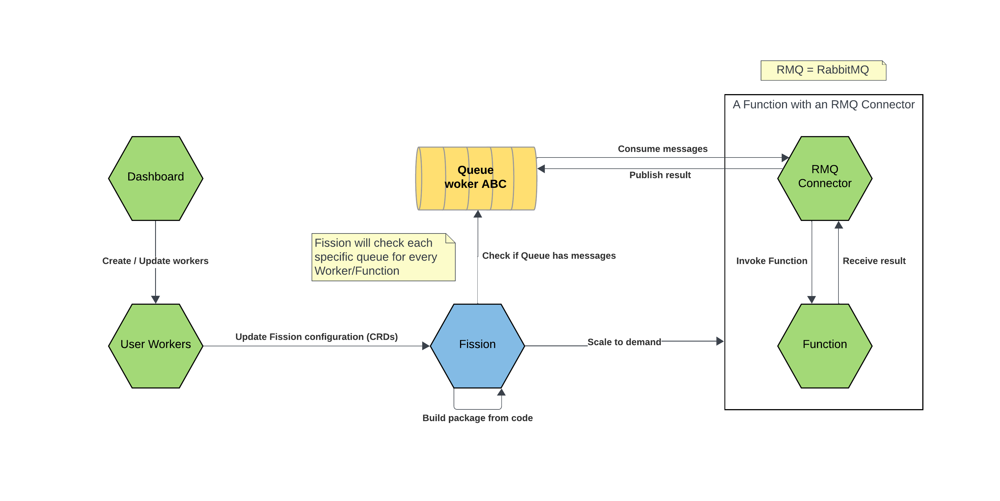
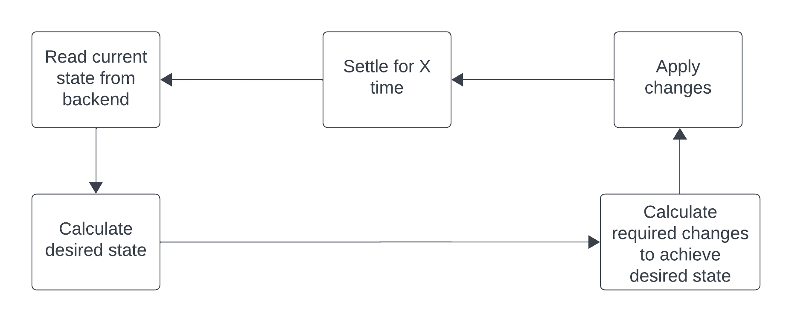

# Workers (Fission/Docker)

!!! Note
    If you are note familiar with workers read [the introduction](/creating-workers) first.

<figure markdown>

<figcaption>Simplified architecture</figcaption>
</figure>

## User Worker Service

The User Worker Service uses a concept known as Reconciliation to make sure that either Fission or Docker is always in a desired state.
In this case, the desired state is having all enabled workers available for processing data.

Depending on whether SensorBucket is in production or development, a different "Controller" will be used to deploy the workers.
The Fission controller is the only production-ready controller. The Docker controller only exists for development purposes, to avoid forcing developers to run a Kubernetes cluster.

<figure markdown>

<figcaption>A reconciliation loop</figcaption>
</figure>

To determine whether a worker is up-to-date or needs to be redeployed (updated), its revision is compared to the currently deployed revision.
Whenever a worker is updated, its revision is also incremented, which in turn causes the reconciliation loop to update the controller.

## Python code

User Workers are created by implementing the `process(message)` method in Python code in the dashboard. This code is not invoked directly. Instead, there is a wrapper around this code which facilitates things like: (un)marshalling responses, error handling and helper classes/utilities.

This code can be found [here in the repository](https://github.com/sensorbucket/SensorBucket/blob/main/services/fission-user-workers/service/python/base.py).

## Production (Fission)

!!! Note
    This chapter assumes existing knowledge about Fission. To learn more, check out [the Fission architecture documentation](https://fission.io/docs/architecture/).

Workers are deployed to Fission as Functions. A Function uses a Package which is bundled or compiled code. Because all Fission Functions are invoked through HTTP, a separate connector is required. In this case a custom RabbitMQ Connector, which consumes from a Queue and published to a result queue or error queue. The connector consumes a message and makes a request to the Function. The Function must return a header `X-AMQP-Topic`, indicating which is used as the topic / routing-key in the result queue. If the response has a not-ok status code, the result will be published to the error queue.

The User Service Fission controller will automatically reconciliate Fission and KEDA CRDs to ensure every enabled worker will be deployed. These resources include: Functions, Message Queue Triggers and Packages. Fission will create the corresponding KEDA resources by deriving them from the Message Queue Trigger.

The Message Queue Trigger - and thus KEDA - is configured to use the RabbitMQ-Connector, which in turn will create the corresponding Message Queues and Exchanges.

!!! Warning
    Workers require access to the core service's devices endpoint. Due to how Fission works, the environment variable `ENDPOINT_DEVICES` must be set on the Fission Python Environment. This must be set during deployment and will **not** happen automatically.

    Below is an example environment which has this variable set.

    ```yaml
    apiVersion: fission.io/v1
    kind: Environment
    metadata:
      name: python
      namespace: default
    spec:
      builder:
        command: build
        container:
          name: ""
          resources: {}
        image: fission/python-builder-3.10
      imagepullsecret: ""
      keeparchive: false
      poolsize: 3
      resources: {}
      runtime:
        container:
          env:
          - name: ENDPOINT_DEVICES
            value: http://core/devices
          name: ""
          resources: {}
        image: fission/python-env-3.10
      version: 2
    ```


## Development (Docker)

Docker is the development controller for user-workers. Instead of creating kubernetes resources, it will directly create and run docker containers. 

This controller does not run Fission, therefore there is no concept of Functions, Message Queue Triggers and connectors. The fission-user-workers package contains a python "dockerworker" service, which is responsible for loading the correct worker from a URL. This URL is automatically injected by the controller. 

No manual setup should be required. Make sure that the "userworkers_dockerworker" service is built, or that the correct docker image is available. Also see the docker-compose.yaml file or `./services/fission-user-workers/service/dockerworker`.
