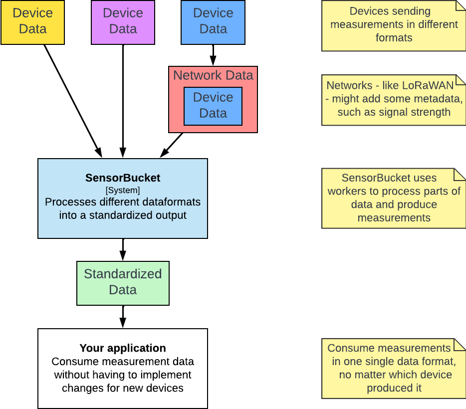

# Sensorbucket

Consume measurements without worrying about obscure data formats.

SensorBucket processes data from different devices from different sources (HTTP, MQTT, FTP, ...) in different data formats (TheThingsNetwork, Multiflexmeter, CayenneLPP, proprietary, ...) and outputs all measurements in a single format.

Your application might require air temperature data from location XYZ. It should not have to worry about whether that sensor was created by manufacturer A or Z.

<figure markdown>
{ width="600"}
</figure>

