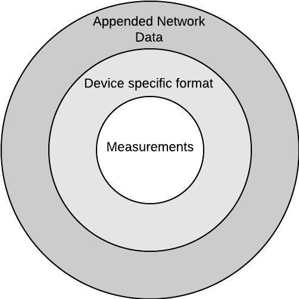
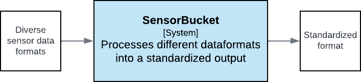

# Introduction

This page contains more details about how SensorBucket works.

The rise of Internet-of-Things (IoT) sensors allows us to gather (environmental) data more frequently than ever before. Networks such as LoRaWAN provide low-power and long-range coverage, sometimes even free of charge.

While the rise of IoT sensors is great, it also has drawbacks. One of these drawbacks is the fragmented datastreams. If you were to look for an IoT air temperature sensor, you will find more than a handful of different manufacturers and devices. Each of these having using their own dataformat and potentialy routed through their own infrastructure.

## The problem

The fragmentation in datastreams and formats is a real obstacle when it comes to consuming the data in other systems. These data consuming systems must now take into account who the manufacturer of each sensor is and what dataformat was used to even be able to understand what the measurement result was.

To make it even more difficult, certain networks append extra metadata to the data sent by the sensor. One example would be LoRaWAN. LoRaWAN networks also send data such as: a sensor identifier on the network, which gateways received the sensor message and what the signal strength was.

All this metadata can also be useful and should not be discarded, but it does add another layer of vendor specific formatting to the received messages. The figure below illustrates how a measurement is first encoded by the device and then potentially by the network, each adding a "layer".

<figure markdown>
{ width="300" }
</figure>

## Ideal world 

In an ideal world the data consuming system should only have to know parameters relevant to the actual measurements, such as: 

 - the timespan
 - the measurement type 
 - potentially a location or device identifier.

As a result querying measurements is identical for all incoming sensor data. This also allows the sensor network to be expanded with new sensors and any data consuming systems can use them right away.

## The solution: SensorBucket

SensorBucket is an extendable system of services working together to become a generic gateway for sensor data.

<figure markdown>
{ width="600" }
</figure>
