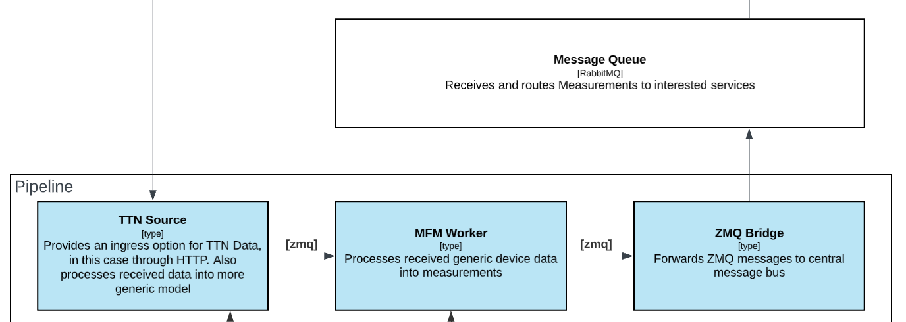
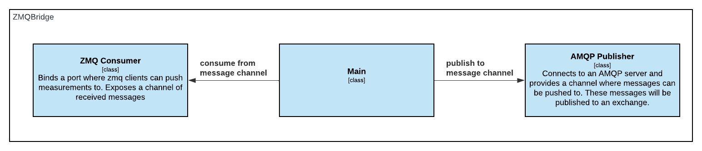

# ZMQ-AMQP Bridge

The ZMQ AMQP Bridge (from here on called the bridge) is responsible for publishing received measurements to an AMQP exchange. The bridge binds a ZMQ Router socket to which workers can push measurements. These measurements will be forwarded to a preconfigured exchange.

<Figure markdown="1">

</Figure>

The bridge contains some level of recovery. ZMQ sockets will automatically recover where possible, the AMQP connection will also reconnect if disconnected. While the AMQP connection is down messages are queued on the bridge through a Go channel. Once connection is reestablished all queued messages will be processed.

<Figure markdown="1">

</Figure>

## Environment variables

| Env                   | Description                                                 |
| --------------------- | ----------------------------------------------------------- |
| WORKER_AMQP_HOST      | The connection string to the AMQP server                    |
| WORKER_AMQP_XCHG      | The exchange which messages will be forwarded to            |
| WORKER_AMQP_ROUTE_KEY | The routing key which will be used when forwarding messages |
| WORKER_ZMQ_BIND       | The address the ZMQ Socket will bind on                     |